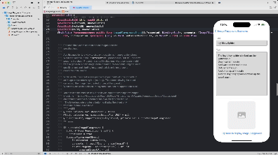

# Image Playground Examples

- Basic integration (iOS and macOS with SwiftUI, UIKit, and AppKit)
- Simple Concept (text string input)
- Extracted Concept (title and long-form text string inputs)
- Source Images (input reference image [online url or photo library])

## Basic Integration

<kbd>
    
</kbd>

## Simple Concept (text string input)

<kbd>
    
</kbd>

## Extracted Concept (long-form text string input)

Takes in a title + long-form text and extracts concepts

<kbd>
    
</kbd>

## Source Image (Online URL)

<kbd>
    
</kbd>

## Source Image (Photo Library)

<kbd>
    
</kbd>

